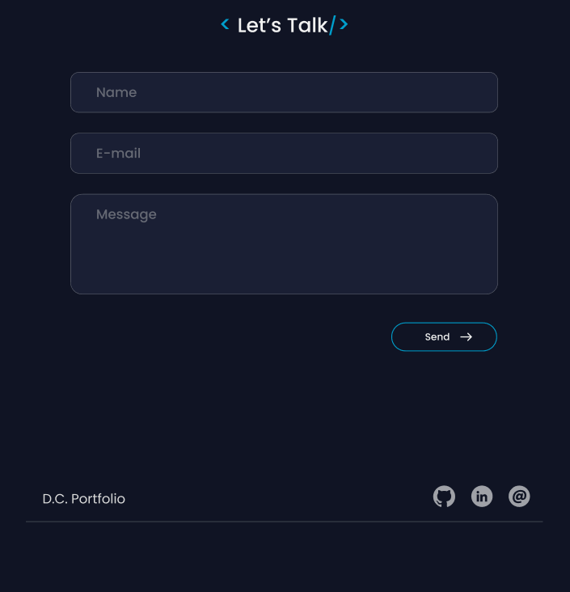

# [Portfolio](https://diegocoura.vercel.app/)

👨‍💻 My Portfolio made with ReactJS.

### [**Live Page**](https://diegocoura.vercel.app/)

## 🛠️ Tools

VSCode | ReactJS | Bootstrap

## 💬 About

This portfolio project was made with ReactJS, Bootstrap and a Email JS. In this process I learned a lot about responsiveness.

##  Layout

###  [Linkedin](https://www.linkedin.com/in/diego-coura-18b88317b/)
